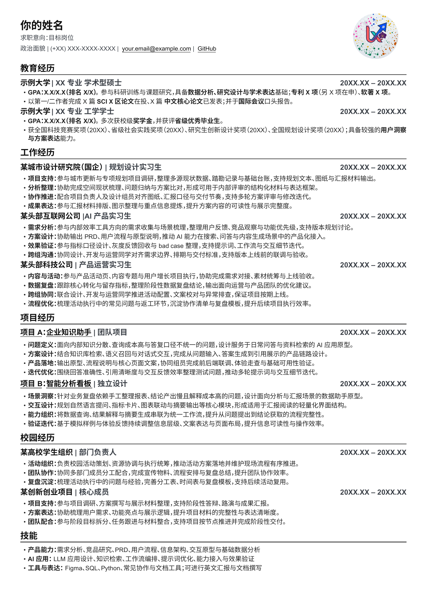

# 一款极简风格高信息密度中文求职简历模板

[](LICENSE)


[](https://github.com/luoxinlan322-sudo/minimal-resume-template-skill/commits/main)

适用于中文单页求职简历，偏极简风格与高信息密度，包含教育、工作/实习、项目、校园经历、技能等常用模块。

## 预览



## 仓库结构

- `template/`：LaTeX 模板正文、类文件、字体、头像占位图与许可证
- `input_templates/`：用户填写模板
- `resume_latex_skill/`：简历生成与编译 skill
- `resume_layout_optimizer_skill/`：排版诊断与单页优化 skill
- `install_codex_skill.ps1`：一键安装两个 skill 到本机 Codex skills 目录
- `setup_windows.ps1`：Windows 环境检查与模板编译脚本

## 输入模板

当前推荐并已验证的输入格式只有两种：

- `input_templates/resume_input_template.md`
- `input_templates/resume_input_template_word.docx`

建议：

- 结构化内容更强、便于版本管理时，用 `Markdown`
- 更习惯 Office 编辑时，用 `Word`

## 依赖

- `XeLaTeX`
- 英文字体：`Arial`
- 中文字体文件：
  - `template/fonts/NotoSansSC-Regular.ttf`
  - `template/fonts/NotoSansSC-Bold.ttf`
  - `template/fonts/NotoSansSC-SemiBold.ttf`
  - `template/fonts/NotoSansSC-ExtraBold.ttf`

## 模板直接使用

### 一键准备与编译

```powershell
.\setup_windows.ps1
```

脚本会：

- 检查 `xelatex` 是否可用
- 如未安装，则通过 `winget` 安装 `MiKTeX`
- 检查系统是否存在 `Arial`
- 直接编译 `template/main.tex`

### 手动编译

```powershell
cd template
xelatex -interaction=nonstopmode -halt-on-error main.tex
xelatex -interaction=nonstopmode -halt-on-error main.tex
```

## Skill 安装

### 一键安装

```powershell
powershell -ExecutionPolicy Bypass -File .\install_codex_skill.ps1
```

安装后会写入：

- `resume-latex-builder`
- `resume-layout-optimizer`

默认安装位置：

- `$CODEX_HOME/skills/`
- 若未设置 `$CODEX_HOME`，则安装到 `~/.codex/skills/`

### 手动安装

如果你想手动复制，可将以下两个目录分别复制到本机 Codex skills 目录：

- `resume_latex_skill/` -> `resume-latex-builder`
- `resume_layout_optimizer_skill/` -> `resume-layout-optimizer`

## Skill 使用

### `resume-latex-builder`

适合：

- 根据 `Markdown` 或 `Word` 模板生成简历
- 自动复制模板资产
- 自动转码、渲染、编译
- 输出 `main.tex`、`main.pdf`、`layout_tasks.json`

你可以在聊天里这样触发：

- `use resume-latex-builder，把这个 md 改成简历并编译`
- `use resume-latex-builder，把这个 word 模板生成 pdf`

### `resume-layout-optimizer`

适合：

- 已有 `main.tex / main.pdf` 时做排版诊断
- 检查是否超页
- 找出具体哪条 bullet 占行过多
- 生成 `layout_tasks.json` 供 agent 逐条压字和复检

你可以在聊天里这样触发：

- `use resume-layout-optimizer，检查这份简历为什么超页`
- `use resume-layout-optimizer，只优化排版不要重写内容`

## 端到端脚本

### 从 Markdown 生成

```powershell
powershell -ExecutionPolicy Bypass -File .\resume_latex_skill\scripts\build_from_md.ps1 -InputPath .\input_templates\resume_input_template.md
```

### 从 Word 生成

```powershell
powershell -ExecutionPolicy Bypass -File .\resume_latex_skill\scripts\build_from_word.ps1 -InputPath .\input_templates\resume_input_template_word.docx
```

说明：

- 如果输入文件所在目录没有模板资产，脚本会自动复制一份
- 默认输出到输入文件**同目录**
- 输出包括：
  - `main.tex`
  - `main.pdf`
  - `layout_diagnosis.json`
  - `layout_tasks.json`

## 常见问题

### 1. `xelatex not found`

说明本机尚未安装或未正确配置 `XeLaTeX`。  
可直接运行：

```powershell
.\setup_windows.ps1
```

### 2. 字体缺失或显示异常

请确认以下中文字体文件位于 `template/fonts/` 目录下：

- `NotoSansSC-Regular.ttf`
- `NotoSansSC-Bold.ttf`
- `NotoSansSC-SemiBold.ttf`
- `NotoSansSC-ExtraBold.ttf`

同时请确认系统已安装英文字体 `Arial`。

### 3. 已生成 `main.tex` 但排版超页

使用 `resume-layout-optimizer`，或直接查看生成的 `layout_tasks.json`，只压缩被点名的 bullet，再运行复检脚本。
